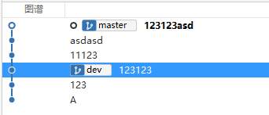
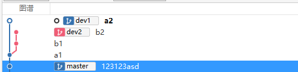
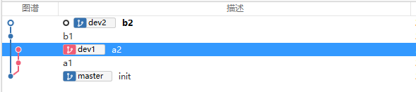

# 代码整洁之道

## 专业主义
> 前任领导：程序员是个良心活


专业主义的精髓在于将公司的利益视同个人的利益。相较于非专业，专业人士必须要承担自己的岗位责任。

### 如何成为专业的软件设计师？

#### 代码层次

1. 不写BUG

    没有人能够完美的软件，但是我们有必要准求完美。可通过以下途径提高代码质量。
    1. 提高送测质量。
    2. 使用自动化测试提高代码质量。


2. 重构
    
    如果希望自己的代码灵活可变，那就应该时刻修改它！想要证明软件易于修改，你便时刻修改它。

    为什么大多数开发人员不敢不断的修改他的代码呢？因为他们害怕会改坏代码，为什么有这样的担心呢，因为没有做过测试。

    ::: tip 提示
    童子军原则: 
    对每个模块，每一次检入代码，都应当比上次检出时，更加整洁。
    :::


#### 职业发展
职业发展是自己的事，不要依托与老板以及公司业务。不断的吸取知识，在空暇时间，不断为自己充电。一下为几个有对程序法职业发展有利的学习途径。
1. 专业技能
    - [ ] 设计模式。必须能描述GOF书中24中设计模式，同时还要有POSA书中多数模式的实战经验。
    - [ ] 设计原则。SOLID设计原则，并深刻理解组件设计原则。
    - [ ] 方法。XP、Scrum、精益、看板、瀑布、结构化分析与结构化设计。
    - [ ] 实践。测试驱动开发、面向对象设计、结构化编程、持续集成、结对编程。
    - [ ] 工件。UML、DFD、结构图、Peetri网络图、状态迁移图表、流程图、决策表

2. 其他
   1. 坚持学习 - 不懂就学，不要畏难。
   2. 不断练习
   3. 合作&交流
   4. 了解业务领域
# Git变基与Cherry-Pick

# 变基 rebase

[中文文档](https://git-scm.com/book/zh/v2/Git-%E5%88%86%E6%94%AF-%E5%8F%98%E5%9F%BA)

[英文文档](https://git-scm.com/docs/git-rebase)


## 什么是变基

git变基与merge相似，

```bas
a -> b -> c				master
  \
    d -> e				dev
```

当在master分支执行`git rebase dev`命令之后

```bash
a -> b ->c ->d -> e 	master
  \
  	d -> e
```

举一个更加复杂的例子，有一个git仓库分支图谱如下


在master分支执行`git merge dev`命令后：


回退到123123asd提交记录，执行`git rebase dev`命令后：




## --onto



如果只想将dev2中的b1, b2 两次提交合并到master分支，但不合并a1提交，则可以使用--onto参数。

用法：

```bash
git rebase base from to
```

此时应该使用命令

```bashe
git rebase master dev1 dev2
```




## rebase 后如何吃后悔药

```bash
# 1. 使用git reflog 查看日志
git reflog --date=iso
```

日志输入如下：

```
701746e (HEAD -> dev2) HEAD@{2021-03-28 20:39:17 +0800}: reset: moving to 701746e
d60d393 HEAD@{2021-03-28 20:38:55 +0800}: reset: moving to d60d393
701746e (HEAD -> dev2) HEAD@{2021-03-28 20:35:55 +0800}: rebase finished: returning to refs/heads/dev2
701746e (HEAD -> dev2) HEAD@{2021-03-28 20:35:55 +0800}: rebase: b2
d60d393 HEAD@{2021-03-28 20:35:55 +0800}: rebase: b1
625b41c (master) HEAD@{2021-03-28 20:35:55 +0800}: rebase: checkout master
8680163 (dev1) HEAD@{2021-03-28 20:35:04 +0800}: commit: a2
9ed1633 HEAD@{2021-03-28 20:34:56 +0800}: checkout: moving from master to dev1
625b41c (master) HEAD@{2021-03-28 20:34:37 +0800}: checkout: moving from dev2 to master
9c15014 HEAD@{2021-03-28 20:34:29 +0800}: commit: b2
c0294d6 HEAD@{2021-03-28 20:34:15 +0800}: commit: b1
9ed1633 HEAD@{2021-03-28 20:33:49 +0800}: checkout: moving from dev1 to dev2
9ed1633 HEAD@{2021-03-28 20:33:43 +0800}: commit: a1
625b41c (master) HEAD@{2021-03-28 20:33:27 +0800}: checkout: moving from master to dev1
625b41c (master) HEAD@{2021-03-28 20:33:23 +0800}: commit (initial): init
```

找到操作点，并使用git reset 还原

```base
git reset 8680163
```


# Cherry-Pick

> [阮一峰技术博客](http://www.ruanyifeng.com/)

git cherry-pick 就是将一个或多个commit，提取出来，并在当前分支产生新的提交：

```bash
# 单个提交
git cherry-pick <commit hash>
# 当后面为分支名时，表示最新的提交
git cherry-pick featrue
# git 合并多个commit，(A, B] 前开后闭
git cherry-pick A..B
# git 合并 [A, B] 前后包含
git cherrt-pick A^..B
```


## 处理冲突

当git cherry-pick出现冲突时，可以使用三个参数

```bash
git cherry-pick --continue  #处理完冲突后并将代码加入暂存区后，执行该命令继续
git cherry-pick --abort # 放弃，并退回到开始版本
git cherry-pick --quit # 退出，但不回退已经合并的代码
```
