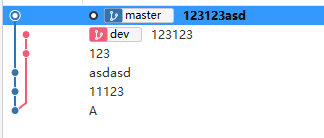
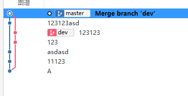
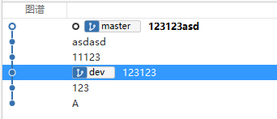
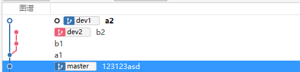
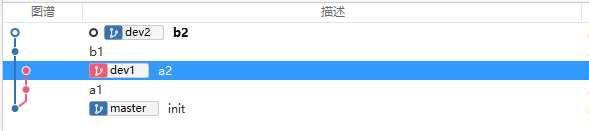

# Git变基与Cherry-Pick

# 变基 rebase

[中文文档](https://git-scm.com/book/zh/v2/Git-%E5%88%86%E6%94%AF-%E5%8F%98%E5%9F%BA)

[英文文档](https://git-scm.com/docs/git-rebase)


## 什么是变基

git变基与merge相似，

```bas
a -> b -> c				master
  \
    d -> e				dev
```

当在master分支执行`git rebase dev`命令之后

```bash
a -> b ->c ->d -> e 	master
  \
  	d -> e
```

举一个更加复杂的例子，有一个git仓库分支图谱如下



在master分支执行`git merge dev`命令后：




回退到123123asd提交记录，执行`git rebase dev`命令后：




## --onto



如果只想将dev2中的b1, b2 两次提交合并到master分支，但不合并a1提交，则可以使用--onto参数。

用法：

```bash
git rebase base from to
```

此时应该使用命令

```bashe
git rebase master dev1 dev2
```




## rebase 后如何吃后悔药

```bash
# 1. 使用git reflog 查看日志
git reflog --date=iso
```

日志输入如下：

```
701746e (HEAD -> dev2) HEAD@{2021-03-28 20:39:17 +0800}: reset: moving to 701746e
d60d393 HEAD@{2021-03-28 20:38:55 +0800}: reset: moving to d60d393
701746e (HEAD -> dev2) HEAD@{2021-03-28 20:35:55 +0800}: rebase finished: returning to refs/heads/dev2
701746e (HEAD -> dev2) HEAD@{2021-03-28 20:35:55 +0800}: rebase: b2
d60d393 HEAD@{2021-03-28 20:35:55 +0800}: rebase: b1
625b41c (master) HEAD@{2021-03-28 20:35:55 +0800}: rebase: checkout master
8680163 (dev1) HEAD@{2021-03-28 20:35:04 +0800}: commit: a2
9ed1633 HEAD@{2021-03-28 20:34:56 +0800}: checkout: moving from master to dev1
625b41c (master) HEAD@{2021-03-28 20:34:37 +0800}: checkout: moving from dev2 to master
9c15014 HEAD@{2021-03-28 20:34:29 +0800}: commit: b2
c0294d6 HEAD@{2021-03-28 20:34:15 +0800}: commit: b1
9ed1633 HEAD@{2021-03-28 20:33:49 +0800}: checkout: moving from dev1 to dev2
9ed1633 HEAD@{2021-03-28 20:33:43 +0800}: commit: a1
625b41c (master) HEAD@{2021-03-28 20:33:27 +0800}: checkout: moving from master to dev1
625b41c (master) HEAD@{2021-03-28 20:33:23 +0800}: commit (initial): init
```

找到操作点，并使用git reset 还原

```base
git reset 8680163
```


# Cherry-Pick

> [阮一峰技术博客](http://www.ruanyifeng.com/)

git cherry-pick 就是将一个或多个commit，提取出来，并在当前分支产生新的提交：

```bash
# 单个提交
git cherry-pick <commit hash>
# 当后面为分支名时，表示最新的提交
git cherry-pick featrue
# git 合并多个commit，(A, B] 前开后闭
git cherry-pick A..B
# git 合并 [A, B] 前后包含
git cherrt-pick A^..B
```


## 处理冲突

当git cherry-pick出现冲突时，可以使用三个参数

```bash
git cherry-pick --continue  #处理完冲突后并将代码加入暂存区后，执行该命令继续
git cherry-pick --abort # 放弃，并退回到开始版本
git cherry-pick --quit # 退出，但不回退已经合并的代码
```
